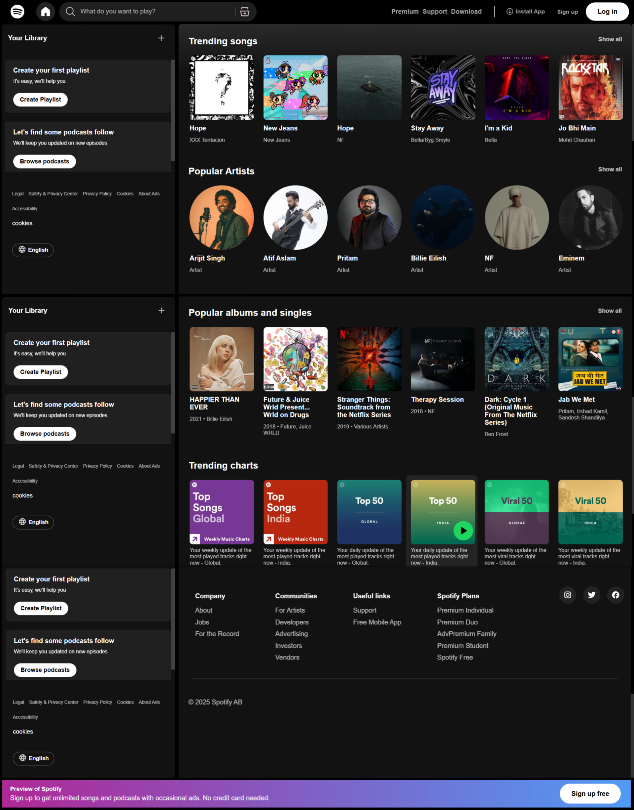

# Spotify Clone (Logged-Out Version)

This isn't technically my first project, but it’s the first one I felt was good enough to upload here.

It’s a *frontend-only clone* of Spotify built with *HTML and CSS*. I aimed to make it as close to the original as possible, though there might be minor differences in fonts or layout. I'm still working on fixing bugs and improving responsiveness.

---
## Why I Built This

I wanted to challenge myself with a real-world layout and test my HTML/CSS skills. It helped me learn a lot about positioning, spacing, and how large-scale UIs are structured.

---

## Screenshots

---
##Demo Video
<video src="./pics/preview/demo.mp4" controls autoplay loop width="100%"></video>
## Currently
- Logged-out version  front-end only

## Next Plans

- Add backend (login/signup system)  
- Make it fully responsive  
- Possibly use JavaScript for interactivity  

## Currently
- Logged-out version  front-end only

## Next Plans

- Add backend (login/signup system)  
- Make it fully responsive  
- Possibly use JavaScript for interactivity  

## Author
**Mahmoodul Hassan**
*[@hazforu](https://github.com/hazforu)*
